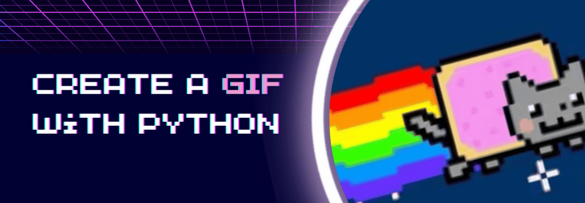

# Create a GIF with Python
## by @sonnynomnom



## Introduction

Do you pronounce it “GIF” or a “JIF”? Either way, Graphics Interchange Format (GIF) are great for creating animated images. The format has been around since 1987 and helped define the early internet. It’s used to display memes, graphics, logos, and they are everywhere — on websites, blogs, emails, and social media.


GIFs are “animated images” because they aren’t exactly videos. They are more like flipbooks; they don’t have sound and they flip through multiple pictures sequentially.

In this project tutorial, I’m going to show you how to combine multiple images and create a GIF using just 6 lines of Python code! More specifically, a list, a `for` loop, and a Python library called `imageio`.

Here’s a preview of the project:


[Image: Two images -> one GIF]
## ImageIO

Imageio is a Python library that provides an easy interface to read and write a wide range of image data. It runs on Python 3.5+.

If you have Python and [pip](https://pip.pypa.io/en/stable) the package installer, you can install `imageio` using this command in the Terminal (Mac) or Command Prompt (Windows):


```sh
pip install imageio
```

Press <kbd>enter</kbd> and this message should appear:

```sh
Successfully installed imageio-2.19.3
```

You can quickly check if `imageio` package was successfully installed, by opening **Python IDLE** and then running the command `import imageio`.

If no errors appear, then the package was successfully installed!
## The 6 Lines of Code

Let’s open up a code editor like [VS Code](https://code.visualstudio.com). 

To use the `imageio` library, we need to first import it:

```py
import imageio
```

Run the code to make sure it works!

Here are three images that you can use for this project (feel free to use your own!):
[team-pic1.png](github link)
[team-pic2.png](github link)
[team-pic3.png](github link)

Make sure to store the image files in the same folder as the one that contains your Python program file.

Inside our Python file, let’s store the file paths in a list and create an empty list to store our image files.

```py
filenames = [“team-pic1.png”, “team-pic2.png”]
images = []
```

Next, let’s use a `for` loop to go through the file paths, and read the images using `imageio`’s `.imread()` method:

```py
for filename in filenames:
  images.append(imageio.imread(filename))
```

The `.imread()` method loads an image based on the file path. So now, our `images` variable has all the images!

Lastly, let’s use the `.mimsave()` method to turn the images into a GIF:

```py
imageio.mimsave(‘movie.gif’, images, ‘GIF’, duration = 1)
```

This takes in four arguments:
- `‘movie.gif`’: The new file name
- `images`: The list of images that we are using
- `‘GIF’`: GIF format
- `duration = 1`: The number of seconds


And that’s it! Here’s the whole program:


```py
import imageio

filenames = [“team-pic1.png”, “team-pic2.png”]
images = [ ]

for filename in filenames:
  images.append(imageio.imread(filename))

imageio.mimsave(‘movie.gif’, images, ‘GIF’, duration = 1)
```

Let’s run this program and see what happens!

[Image of three images -> 1 GIF]
## Wrapping Up

Congrats! We have created a meme GIF in just 6 lines of code. Now we don’t have to rely on paid online tools to turn our images into GIFs, we just need a list, a `for` loop, and the `imageio` library to do the trick. 

Let us know what GIFs you have created using this code on Twitter! Tag us [@codedex_io](https://twitter.com/codedex_io).

### Additional Resources

Solution code: [GitHub link]
Imageio documentation: https://imageio.readthedocs.io/en/stable/index.html 
Original Tweet: Tweet link.

