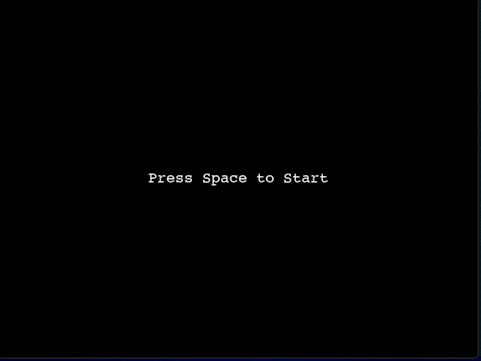

# Creating a Pong Clone with Python and PyGame


**Prerequisites:** Python fundamentals, Game development concepts
**Versions:** Python 3.10
**Read Time:** X minutes  

## [#](#-introduction) Introduction

Can you guess what the first video game ever created was? It was called Pong, and with today's technology, it's super easy to make!
In this tutorial, you'll learn how to make your very own Pong clone, 
using Python and the PyGame library. You will learn how this game engine works, and how you can
make simple collision detection so you and a friend can play Pong on the same computer!

This is what the game will look like at the end:



Without any further ado, let's get into it!

**NOTE**: It is recommended that you go through the "Legend of Python" course making this Pong clone.

## [#](#-subtitle) Setting Everything Up

Before writing any code, go into your terminal and install the Pygame library using pip. Here, we're using the `pip3` command (which comes with pip),
because we'll be writing our code for version 3 of Python.
```sh
pip3 install pygame
```

It's also a good idea to wrap our code in a `main()` function, and to call that function when the script is run.
To do this, you simply need to add this to the Python file: 

```py
def main():

if __name__ == '__main__':
  main()
```

For more information on what the equality check means, click [here](https://stackoverflow.com/questions/419163/what-does-if-name-main-do-in-python).

Also, add `import pygame` and `import random` at the start of the file to import the `pygame` and `random` libraries.

## [#](#-subheading) Creating a Window

Before we code any of the game logic, we first need to render a simple window with PyGame. We'll also set the screen size to `960x720` and the
background color to `COLOR_BLACK` (a constant). We also go over the `Pygame` event loop, to check for the `QUIT` event. If this event is triggered,
we exit the function by calling `return`. This event loop will be used again later. Finally, we also set the name of the window to "Pong". 
Here is the code for all of this

```py
# constants for the windows width and height values
SCREEN_WIDTH = 960
SCREEN_HEIGHT = 720

# the RGB values for the colors used in the game
COLOR_BLACK = (0, 0, 0)
COLOR_WHITE = (255, 255, 255)

def main(): 
  # GAME SETUP
  
  # initialize the PyGame library (this is absolutely necessary)
  pygame.init()

  # this creates the window for the game
  screen = pygame.display.set_mode((SCREEN_WIDTH, SCREEN_HEIGHT))

  # set the window's title
  pygame.display.set_caption("Pong")

  # GAME LOOP
  while True:
    """ 
    set the back ground color to black
    needs to be called everytime the game updates
    """
    screen.fill(COLOR_BLACK)

    # checking for events
    for event in pygame.event.get():

      # if the user exits the window
      if event.type == pygame.QUIT:

        # exit the function, to finish the game
        return
```

**NOTE**: You will notice that I have separated the code before and after the `while` loop with two comments. 
From now on, I will refer to the code before this loop as the setup. The code after will be called the game loop.

You can also see that we initialized some variables before the `main()` function. Since these are constants
(i. e. they will not change), it is best to name them with capitalized letters. Now you will see that in the game loop
we have a `for` loop to go through `pygame.event.get()`. This is where all the game engine related events
(such as the user exiting the window, keypresses, etc.) will be handled. You can also create your own custom events,
though that will not be covered in this tutorial. Here we simply check if the event list contains the `pygame.QUIT` event,
which is triggered when the [X] button is clicked on a window. If that is the case, we simply `return` out of the
`main()` function, which ends the `while` loop and closes the window.

You can run the script, and an empty window should appear.

## [#](#-subheading) Creating the Players and the Ball

Now, in the setup, we need to add some variables for the players and the ball. For the players, they each need a `Rect` object,
which is essentially a rectangular sprite with collisions. We also need "move" variables to old the value of the players' movement.
For the ball, we have a `Rect` as well, and two "acceleration" variables (similar to the players' "move" variables). We set those to
a random number between 2 and 4 to give some speed variety. We also randomize the direction of the ball by multiplying the acceleration
variables by -1, one times out of two. We do this multiplication because, by default, a positive `ball_accel_x` will make the ball go right 
(because of `Pygame` coordinates). A positive `ball_accel_y` will make the ball go down. By multiplying these variables on the flip of a coin
we randomize the vertical and horizontal direction of the ball. Here is the code for this part (it goes in the **setup** section):

```py
"""
these are the players' game paddles
the `Rect` function need the x, y, width and height
of the rectangles we will be drawing
"""
paddle_1_rect = pygame.Rect(30, 0, 7, 100)
paddle_2_rect = pygame.Rect(SCREEN_WIDTH - 50, 0, 7, 100)

# this is to track by how much the players' paddles will move per frame
paddle_1_move = 0
paddle_2_move = 0

# this is the rectangle that represents the ball
ball_rect = pygame.Rect(SCREEN_WIDTH / 2, SCREEN_HEIGHT / 2, 25, 25)

# determine the x and y speed of the ball (0.1 is just to scale the speed down)
ball_accel_x = random.randint(2, 4) * 0.1
ball_accel_y = random.randint(2, 4) * 0.1

# randomize the direction of the ball
if random.randint(1, 2) == 1:
  ball_accel_x *= -1
if random.randint(1, 2) == 1:
  ball_accel_y *= -1
```

Finally, to draw these rectangles to the screen, add this add the **bottom of the game loop**:

```py
# draw player 1 and player 2's rects with the white color
pygame.draw.rect(screen, COLOR_WHITE, paddle_1_rect)
pygame.draw.rect(screen, COLOR_WHITE, paddle_2_rect)

# draw the ball with the white color
pygame.draw.rect(screen, COLOR_WHITE, ball_rect)

# update the display (this is necessary for Pygame)
pygame.display.update()
```

## [#](#-subheading) Making the Ball Move

Next, let's make the ball move! First we'll need to define a variablesin the **setup**: it is a PyGame `Clock` object. 
This is probably the most important part of the code, since it allows us to tell what the time is, but most importantly, allow us to determine the [delta time](https://en.wikipedia.org/wiki/Delta_timing). 
Here is the code for that:

```py
# create the clock object to keep track of the time
clock = pygame.time.Clock()

"""
this is to check wheter or not to move the ball
we will make it move after 3 seconds
"""
started = False
```

In the loop, let's add this little bit of code. This code snippet will also include setting the `delta_time` variable.

```py
"""
get the time elapse between now and the last frame
60 is an arbitrary number but the game runs smooth at 60 FPS
"""
delta_time = clock.tick(60)
```
Before that, in the loop, let's add a start screen. This can be easily done with the following code (place it after the line that make the screen black):

```
# make the ball move after 3 seconds
if not started:
  # load the Consolas font
  font = pygame.font.SysFont('Consolas', 30)

  # draw some text to the center of the screen
  text = font.render('Press Space to Start', True, COLOR_WHITE)
  text_rect = text.get_rect()
  text_rect.center = (SCREEN_WIDTH // 2, SCREEN_HEIGHT // 2)
  screen.blit(text, text_rect)

  # update the display
  pygame.display.flip()

  for event in pygame.event.get():
    if event.type == pygame.QUIT:
      pygame.quit()
      return
    if event.type == pygame.KEYDOWN:
      if event.key == pygame.K_SPACE:
        started = True

   continue
```

**NOTE**: when looking at the next part of the code, please keep in mind that that PyGame coordinates place (0, 0) at the top-left corner of the screen, and that
increasing x means going to the right, and increasing y means going down.

To finish making the ball move, add this code to the end of the **game loop**, right before where we draw the rectangles. First we check if the ball goes out of bounds 
on the right or left side of the screen. If it does, we end the game by ending the function. Next, we check if the ball rectangle collides with the player rectangles.
We also check if the ball is in front of the paddle, because if it isn't, then it doesn't make sense to change its direction. To change it, we simply multiply the `ball_accel_x`
variable from earlier by -1, and add or substract some value to or from x (for a PyGame `Rect`, this is called `left`), to make sure no glitchy collisions happen (if you
don't believe me, try removing those two lines, and play around for a bit. You'll see what I mean). Finally, if the ball can move (i.e. if `started` is `True`), we simply
move the ball by adding the `ball_accel_x` and `ball_accel_y` to the `left` and `top` properties of the `ball_rect` object (remember to always multiply by `delta_time`). 
Here is the code:

```py
# if the ball goes out of bounds, end the game 
if ball_rect.left <= 0 or ball_rect.left >= SCREEN_WIDTH:
  return

"""
if paddle_1_rect collides with the ball and the ball is in front of it, 
change the speed of the ball and make it move a little in the other way
"""
if paddle_1_rect.colliderect(ball_rect) and paddle_1_rect.left < ball_rect.left:
  ball_accel_x *= -1
  ball_rect.left += 5
# do the same with paddle_2_rect
if paddle_2_rect.colliderect(ball_rect) and paddle_2_rect.left > ball_rect.left:
  ball_accel_x *= -1
  ball_rect.left -= 5

# if the game is started (after 3 seconds this is true)
if started:
  # move the ball
  ball_rect.left += ball_accel_x * delta_time 
  ball_rect.top += ball_accel_y * delta_time
```

## [#](#-subheading) Making the Players Move

Making the players move is slightly more complicated. However, the result is definitely worth it. Since, in PyGame, `KEYDOWN` and `KEYUP` events are different things,
we need to check for both. When it's `KEYDOWN`, we set the "move" variable to move the player. When it's `KEYUP`, we can reset the "move" variable. We only actually move
the players after this. Here is the code, that goes in the `for event in pygame.event.get():` loop:

```py
# if the user is pressing a key
if event.type == pygame.KEYDOWN:

  # PLAYER 1
  # if the key is W, set the movement of paddle_1 to go up
  if event.key == pygame.K_w:
    paddle_1_move = -0.5

  # if the key is S, set the movement of paddle_1 to go down
  if event.key == pygame.K_s:
    paddle_1_move = 0.5

  # PLAYER 2
  # if the key is the up arrow, set the movement of paddle_2 to go up
  if event.key == pygame.K_UP:
    paddle_2_move = -0.5
  # if the key is the down arrow, set the movement of paddle_2 to go down
  if event.key == pygame.K_DOWN:
    paddle_2_move = 0.5

# if the player released a key
if event.type == pygame.KEYUP:
  # if the key released is w or s, stop the movement of paddle_1
  if event.key == pygame.K_w or event.key == pygame.K_s: 
    paddle_1_move = 0.0

  # if the key released is the up or down arrow, stop the movement of paddle_2
  if event.key == pygame.K_UP or event.key == pygame.K_DOWN:
    paddle_2_move = 0.0
```

Add this outside of the loop to move the players:

```py
"""
move paddle_1 and paddle_2 according to their `move` variables
we also multiply the `move` variable by the delta time to keep movement consistent through frames
"""
paddle_1_rect.top += paddle_1_move * delta_time
paddle_2_rect.top += paddle_2_move * delta_time
```

## [#](#-conclusion) Conclusion

And voilà! Your Pong clone is done! You can now play Pong with your friend on the same computer. One of you two uses the W and S keys, while the other uses the UP and DOWN 
arrow keys. If you want to make the game a little better by preventing the players from going completely of limits with their paddles, add in the **game loop**:

```py
if paddle_1_rect.top < 0:
  paddle_1_rect.top = 0
if paddle_1_rect.bottom > SCREEN_HEIGHT:
  paddle_1_rect.bottom = SCREEN_HEIGHT

if paddle_2_rect.top < 0:
  paddle_2_rect.top = 0
if paddle_2_rect.bottom > SCREEN_HEIGHT:
  paddle_2_rect.bottom = SCREEN_HEIGHT 
```

Notice how I haven't commented the code. This is because I want you to try and understand it on your own! Happy coding!

**NOTE**: see below for the full code if you are having trouble with arranging the different snippets.

## [#](#-more-resources) More Resources

- [Full Code on GitHub](https://gist.github.com/ThousandthStar/1591e19ec19ce70d23fd493270da66ed)
- [Documentation: PyGame](https://www.pygame.org/docs/)
