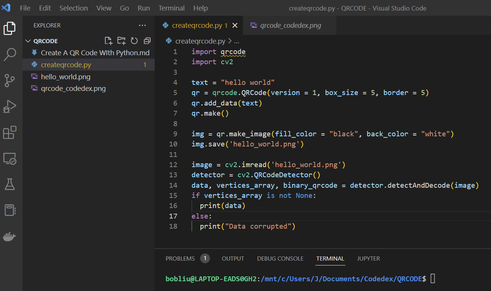

# Set Up Your Local Development Environment with Python

<AuthorAvatar author_name="Jerry Zhu" author_avatar="/images/projects/authors/jerry_zhu.jpg" />


**Prerequisite:** None  
**Versions:** Python 3.10  
**Read Time:** 40 minutes  

## [#](#-introduction) Introduction

At Codédex, we built an online code editor just for you. With no setup required, you can code to your heart’s desire. However, there is one small issue: your code is in the cloud and requires the internet to run! Without Wi-Fi, you can no longer code! This may hinder your progress toward "The Legend of Python"!

However, there is a solution – a local environment! 

Running a program locally means using the resources of the computer that you’re currently using to execute a program. Therefore, a local environment is just a simple setup to get your computer ready to be able to run a program, or in our case, a Python program.  

In this tutorial, we will go over how to install a code editor called VS Code and run Python locally on your own computer. 

Let’s get started!

## [#](#-visual-studio-code) Visual Studio Code

We recommend setting up Visual Studio Code. 

[Visual Studio Code](https://code.visualstudio.com), or VS Code for short, is a code editor created by Microsoft in 2015. It is now the editor of choice for professionals, due to its ease of use and plethora of features. We will highlight some of these features in this tutorial! 


## [#](#-setting-up) Setting Up

### Download VS Code

1. First, [download Visual Studio Code](https://code.visualstudio.com) to your computer.

2. Then, watch this quick 5 min video about Visual Studio code: 

<iframe width="560" height="315" src="https://www.youtube.com/embed/S320N3sxinE" title="YouTube video player" frameborder="0" allow="accelerometer; autoplay; clipboard-write; encrypted-media; gyroscope; picture-in-picture" allowfullscreen></iframe>

3. Follow the video at 2:20 to download the Python extension in VS Code ([minute 2:20](https://www.youtube.com/watch?v=S320N3sxinE&t=140s)).

### Install Python (For Windows Users)

For Windows users, there's a tiny bit more setup. We need to install Python:

1. Go to [python.org](https://www.python.org/downloads/windows/).
2. Look for a Python 3 release under Stable Releases that says "Windows installer (64-bit)" and click on the link.
3. Once it's downloaded, open the installer to install Python 3 on your Windows machine.

You are now ready for the journey ahead.

## Pip

The main feature that comes with installing Python is our package manager pip! Pip is used to download all external Python libaries. To download a library, go into your terminal and run:

```bash
pip install [library-name]
```

## Features



You’ll see in your VS Code dashboard that you have access to a lot of features that are specific to your dev environment!

- On the left-hand side inside the “EXPLORER” section, you can see the structure of your folders and files. 
- The middle is where all your code goes
- On the right, there are tutorials and walkthroughs about how to use VS Code!
- On the bottom, you can see a command line, which is used to access files. You can use either a Windows command prompt or a Linux terminal! 

## Hacks

Here are three Python VS Code hacks that you can start using right away! 

### Hotkeys/Key bindings

A key binding is a key, or a combination of keys, which causes something to happen when pressed. There are multiple key bindings you can use to streamline your dev environment. For example, you can paste the last line multiple times in a loop-like code, or add quotes to multiple strings at the same time! 
Some examples include SHIFT+ALT+↓ or CTRL + D! 

Check the [key bindings docs](https://code.visualstudio.com/docs/getstarted/keybindings) for more details! 

Here is an example of a key binding in action: 

### Debugging

A software bug is an error that might cause a running program to behave in unintended ways, or even crash. While developing a program, programmers often run into bugs themselves. A common strategy to identify which section of the code is causing a bug, is to use `print` statement. However, some bugs can’t be debugged using a single strategy. Introducing the revolutionary technology of debuggers! 

With [VS Code debugging](https://code.visualstudio.com/docs/editor/debugging), you can easily check your code for errors without writing a single line of extra code! We need to install the Python extension to enable debugging capabilities for Python code, which we’ll look at in the next section.

### Extensions

VS Code has a plethora of built-in plugins and extensions to make your coding streamlined and effortless. Find more information [here](https://code.visualstudio.com/docs/languages/python)! These extensions can help you format code, highlight syntax, debugging and even provide real-time documentation with auto complete suggestions! 

Some popular extensions include: 

- [pylance](https://marketplace.visualstudio.com/items?itemName=ms-python.vscode-pylance) 
- [Jupyter](https://marketplace.visualstudio.com/items?itemName=ms-toolsai.jupyter). 

## Conclusion

Now that you’ve created your ideal development environment, go out there and explore “The Legend of Python” with your new set up! 

### More Resources:

- [Visual Studio Code](https://code.visualstudio.com)
- [Python.org](https://www.python.org)
- [pip](https://pypi.org/project/pip)
